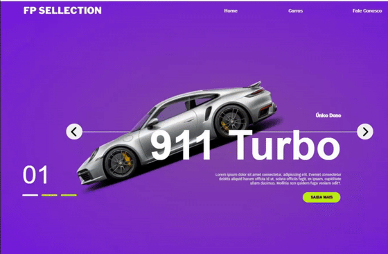

# Transitions Car 🚗✨

Este é um projeto simples para praticar **animações de transições com JavaScript e CSS**, focado em manipulação de elementos na tela com efeitos visuais.

---

## 📌 Sobre o Projeto

O **Transitions Car** é um exemplo didático de como usar eventos do JavaScript junto com transições CSS para criar efeitos de movimento, aparência e sumiço de elementos HTML.

---

## 🚀 Tecnologias Utilizadas:

- HTML5  
- CSS3 (Transições e Animações)  
- JavaScript (Manipulação de DOM e Eventos)

---

## 🎯 Funcionalidades:

- Mostrar o carro na tela ao clicar no botão  
- Ocultar o carro ao clicar novamente  
- Aplicação de efeitos de transição entre as ações

---

## 📷 Demonstração

---

## 🛠️ Estrutura de Pastas:
transitions-car/
├── assets/
│ └── demo.gif
├── index.html
├── style.css
└── script.js

Projeto de aprendizado pessoal focado em DOM Manipulation, Event Handling e CSS Transitions, como parte do estudo de JavaScript Frontend.

📚 Aprendizados até aqui:
Criação de eventos em JavaScript

Manipulação de classes CSS via JS

Controle de transições visuais

Organização de arquivos de front-end

